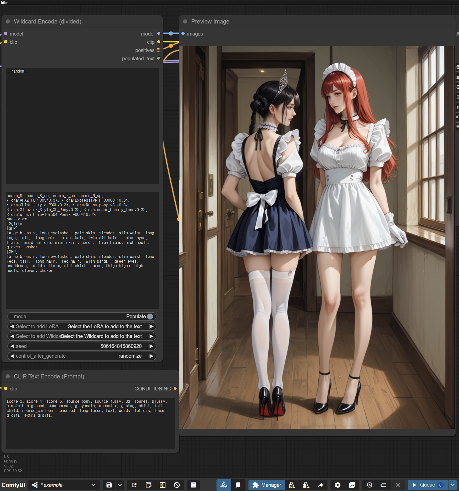
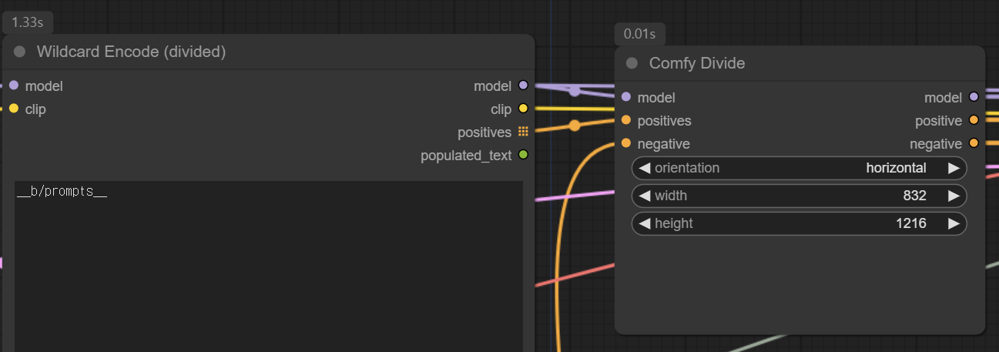

# WildDivide

ComfyUI custom node that specifies wildcard prompts for multiple regions


The above workflow is [docs/example.json](docs/example.json).

## Wildcard Encode (divided)

It has the same syntax as [Impact Pack Wildcards](https://github.com/ltdrdata/ComfyUI-extension-tutorials/blob/Main/ComfyUI-Impact-Pack/tutorial/ImpactWildcard.md).
In addition, it supports the following syntax

### Child selection weight

If you write a number at the beginning, that number becomes the weight to select that line.

```yaml
hair:
  - 4, blonde
  - 5, black
  - 1, red
```

For example, writing `__hair__` will select blonde with a 4/(4+5+1) = 4/10 probability.
If a number is omitted, it is assumed to be 1.
Functionally, this is the same as writing as below in [Impact Pack Wildcards](https://github.com/ltdrdata/ComfyUI-extension-tutorials/blob/Main/ComfyUI-Impact-Pack/tutorial/ImpactWildcard.md).

```yaml
hair:
  - { 4::blonde|5::black|1::red }
```

### Child selection by pattern

If a line starts with `/`, it selects the line when the pattern matches the prompt up to there. For example, if you write

```yaml
outfit:
  - blouse, skirt, __legs__
  - shirt, pants, __legs__
  - swimsuit, __legs__
legs:
  - /skirt/ stockings
  - /pants/ socks
  - bare feet
```

If `__outfit__` selects `blouse, skirt` (by 1/3 chance), `__legs__` will be expanded to `stockings` because `/skirt/` matches.
If there is no matching pattern(`swimsuit` in this case), `bare feet` would be selected.

If a line starts with `~/`, it selects the line when the pattern doesn't match the prompt.
For example:

```yaml
outfit:
  - blouse, skirt
  - dress
  - swimsuit
legs:
  - ~/swimsuit/ stockings
  - bare feet
```

If `swimsuit` doesn't match, `stockings` would be selected. In this case, `blouse, skirt` and `dress`.

### Split region

You can use `[SEP]` to divide an image into different regions. Each `[SEP]` divides the image into _n_ equal parts.

```yaml
scene: blonde hair [SEP] black hair
```

For example, if written as above, `blonde hair` would be applied to the left half of the image, `black hair` would be applied to the right half of the image.

## Comfy Divide



- Connect `positives` to `positives` in `Wildcard Encode (divided)`.
