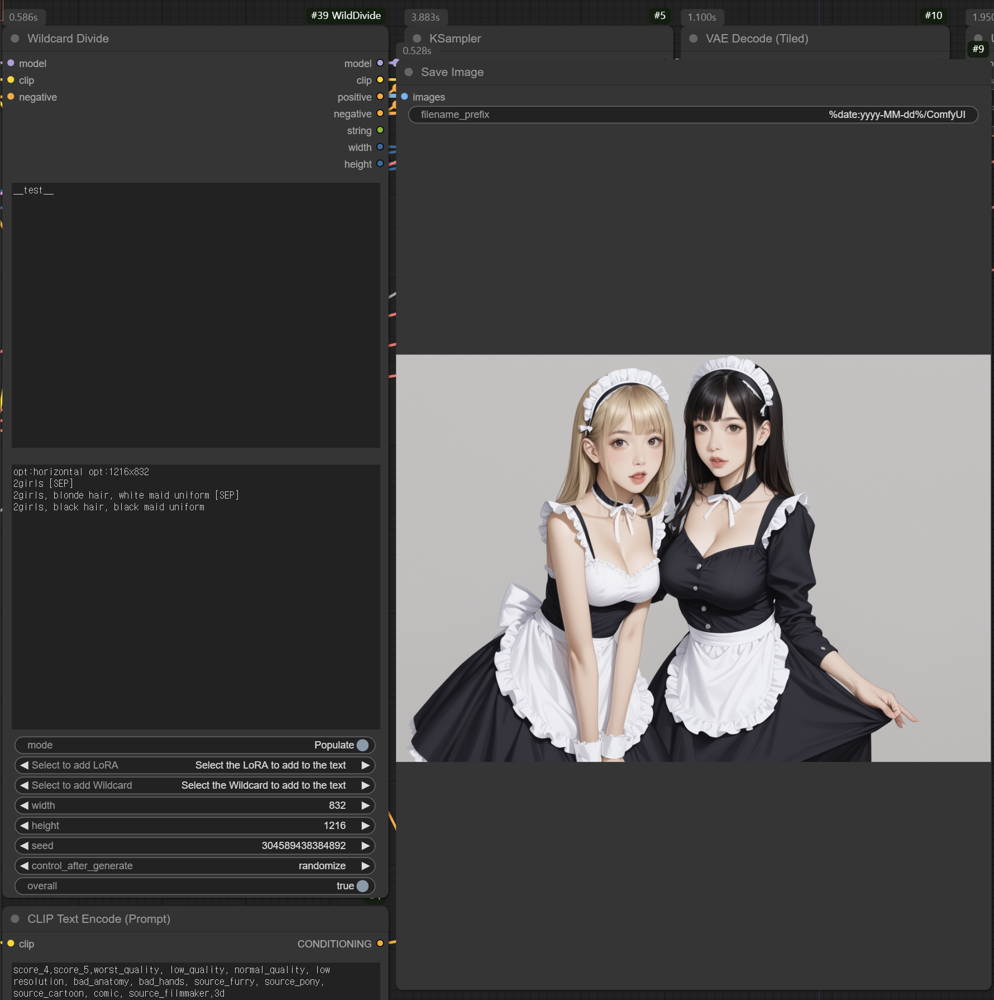

# Wildcard Divide

ComfyUI custom node that specifies wildcard prompts for multiple regions


The above workflow is [docs/example.json](docs/example.json).

## Wildcard Divide Node

This node incorporates the syntax of [Impact Pack Wildcards](https://github.com/ltdrdata/ComfyUI-extension-tutorials/blob/Main/ComfyUI-Impact-Pack/tutorial/ImpactWildcard.md) while introducing additional syntactical features.

### Weighted Child Selection

You can assign selection weights to options by prefixing them with a numerical value. This number determines the likelihood of that particular option being chosen.

```yaml
hair:
  - 4, blonde
  - 5, black
  - 1, red
```

In this example, invoking `__hair__` will result in "blonde" being selected with a probability of 4/(4+5+1) = 4/10 = 0.4.
When a numerical prefix is omitted, a default weight of 1 is assumed.

This weighted selection mechanism is functionally equivalent to the following syntax in [Impact Pack Wildcards](https://github.com/ltdrdata/ComfyUI-extension-tutorials/blob/Main/ComfyUI-Impact-Pack/tutorial/ImpactWildcard.md):

```yaml
hair:
  - {4::blonde|5::black|1::red}
```

### Pattern-based Selection

Lines that start with `/` are pattern matchers. These are selected when the pattern matches
the previously generated prompt. Here's an example:

```yaml
outfit:
  - blouse, skirt, __legs__
  - shirt, pants, __legs__
  - swimsuit, __legs__
legs:
  - /skirt/ stockings
  - /pants/ socks
  - bare feet
```

Here's how the pattern matching works:

1. When `__outfit__` expands to `blouse, skirt` (1/3 probability):
   - `__legs__` will only consider options matching `/skirt/` plus unmatched options
   - Therefore, it will randomly choose between `stockings` or `bare feet`

2. When `__outfit__` expands to `shirt, pants` (1/3 probability):
   - `__legs__` will only consider options matching `/pants/` plus unmatched options
   - Therefore, it will randomly choose between `socks` or `bare feet`

3. When `__outfit__` expands to `swimsuit` (1/3 probability):
   - Since no patterns match, only unmatched options are considered
   - Therefore, it will select `bare feet`

Note: Options without any pattern matcher (like `bare feet` in this example) are always included
as candidates, regardless of the previous prompt.

#### Pattern Alternatives

When a line includes `!`, the text after `!` will be selected when the pattern does not match the prompt. For example:

```yaml
outfit:
  - blouse, skirt
  - dress
  - swimsuit
legs:
  - /swimsuit/ bare feet ! stockings
```

In this example, `stockings` will be selected when the outfit doesn't contain `swimsuit` (i.e., when `blouse, skirt` or `dress` is selected). Conversely, if `swimsuit` is selected, `bare feet` will be chosen.

#### Exclusive Pattern Matching

When a pattern ends with `=`, it becomes an exclusive pattern that will remove all non-matching options from consideration. For example:

```yaml
outfit:
  - blouse, skirt
  - dress
  - swimsuit
legs:
  - /skirt/= stockings
  - bare feet
```

In this example:
- When `__outfit__` selects `blouse, skirt` (1/3 probability):
  - The `/skirt/=` pattern matches
  - Due to the `=` suffix, all non-matching options (in this case, `bare feet`) are excluded
  - Therefore, `stockings` will be selected with 100% probability

- When `__outfit__` selects either `dress` or `swimsuit`:
  - The `/skirt/=` pattern doesn't match
  - Only the non-pattern option `bare feet` remains available
  - Therefore, `bare feet` will be selected with 100% probability

#### Pattern Matching with Conditional Exclusion

The `=~` suffix creates a sophisticated pattern matching rule that combines conditional exclusion with fallback behavior. When a pattern ends with `=~`, it implements the following logic:

```yaml
outfit:
  - blouse, skirt
  - dress
  - swimsuit
legs:
  - /skirt/=~ stockings
  - bare feet
  - socks
```

This operates in two distinct modes:

1. **When Pattern Matches:**
   If `__outfit__` contains `skirt` (probability: 1/3):
   - The `/skirt/=~` pattern activates
   - All non-matching options (`bare feet`, `socks`) are excluded
   - `stockings` is selected with 100% probability

2. **When Pattern Fails:**
   If "skirt" is not present in `__outfit__`:
   - The pattern-matched option (`stockings`) remains in the candidate pool
   - All options become eligible for selection
   - Random selection occurs between `stockings`, `bare feet`, and `socks`

This mechanism provides a elegant way to enforce specific combinations while maintaining flexibility when conditions aren't met.

### Split region

You can use `[SEP]` to divide an image into different regions. Each `[SEP]` divides the image into _n_ equal parts.

```yaml
scene: 2girls [SEP] blonde hair [SEP] black hair
```

For example, if written as above, `2girls` would be applied to the entire image, `blonde hair` to the left half of the image, and `black hair` to the right half.

### Split Direction

You can specify the orientation of the split using the `opt:horizontal` and `opt:vertical` options.

```yaml
scene:
  - opt:horizontal 2girls [SEP] blonde hair [SEP] black hair
  - opt:vertical sky [SEP] blue sky [SEP] red sky
```

This syntax allows for precise control over image segmentation:

1. Horizontal Split (Left to Right):
   If the first option is selected, the image is divided horizontally. In this case:
   - `2girls` applies to the entire image
   - `blonde hair` is applied to the left half
   - `black hair` is applied to the right half

2. Vertical Split (Top to Bottom):
   If the second option is chosen, the image is segmented vertically:
   - `sky` is applied across the entire image
   - `blue sky` affects the top half
   - `red sky` influences the bottom half

### Image Size Specification

You can define the dimensions of the output image using the `opt:`_width_`x`_height_ syntax. This feature allows for dynamic image size adjustment based on the selected option.

```yaml
scene:
  - opt:1216x832 2girls [SEP] blonde hair [SEP] black hair
  - opt:832x1216 sky [SEP] blue sky [SEP] red sky
```

In this example, selecting the second option would result in an image with dimensions of 832x1216 pixels.

To implement this functionality, ensure that you connect the width and height outputs to the empty latent image node in your workflow. This connection enables the dynamic resizing of the output based on the specified dimensions.
